# Informe de reflexión (Documento de texto)

## Descripción del problema de Javascript elegido.

**Objetos en JavaScript** —  Se solicitó a la IA que me explicara cómo funcionan los objetos en JavaScript. Actuó como un Desarrollador Senior. Me lo explicó en términos de Sakura Card Captor. Este contenido estuvo dirigido hacia mi, una desarrolladora Jr con nociones introductorias de JavaScript. Creó una explicación breve y concisa. Quería entender la complejidad del tema en términos que pueda digerir fácilmente con un tema que me gusta y entiendo.

## Evidencia de prompts

Incluye capturas de pantalla o transcripciones de las interacciones clave con la IA que muestren el pensamiento divergente y el desafío al sesgo (Fases 1 y 2).

### FASE 1 - Identificación y pensamiento divergente

Elige un concepto que sea difícil para ti de Javascript (funciones, promesas, arreglos, etc.). Pide a la IA soluciones que combinen este concepto con un tema no relacionado (música, arte, deportes) para crear un snippet único.

**Prompt original** — `Quiero que me expliques cómo funcionan los objetos en JavaScript. Actúa como un Desarrollador Senior. Explícamelo en términos de Sakura Card Captor. Este contenido está dirigido hacia mi, una desarrolladora Jr con nociones introductorias de JavaScript. Crea una explicación breve y concisa. Quiero entender la complejidad del tema en términos que pueda digerir fácilmente con un tema que me gusta y entiendo.`

 

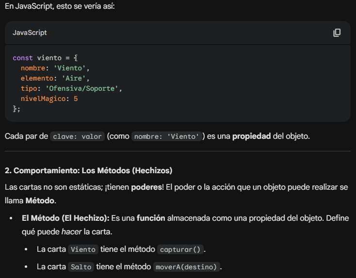

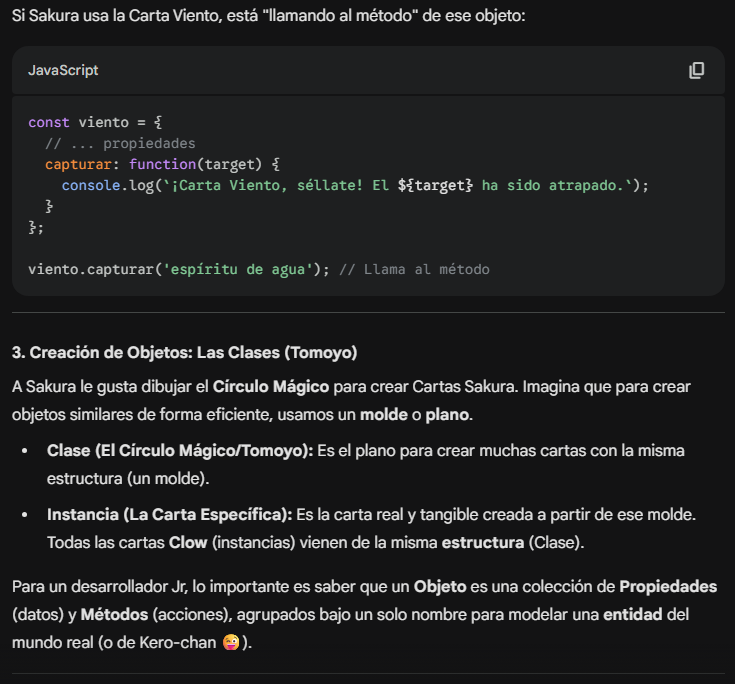

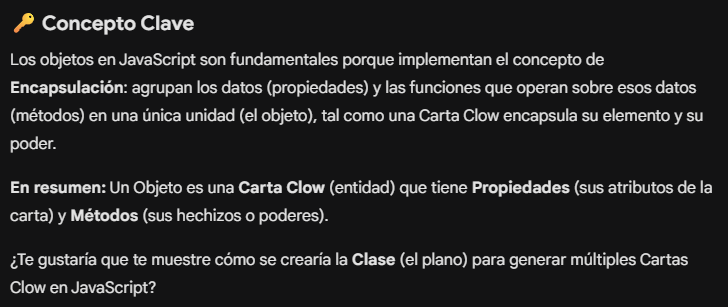

## FASE 2 - Desarrollo y desafío del sesgo

Escoge la idea más original. Pide a la IA que te sugiera una solución que rompa con la práctica estándar (p.ej: resolver un problema de array sin usar map() o usar callbacks en lugar de async/await en un escenario específico). Crea el código basado en este enfoque "prohibido".

**Prompt de Desarrollo y desafío del sesgo** — `Ahora con esta información sugiéreme una aplicación de este concepto con un enfoque no tradicional, desarrolla la idea con un código funcional .js en donde se vea la aplicación del concepto de objeto junto con una  práctica no común entre desarrolladores, pero que siga siendo válida dentro de JavaScript.`

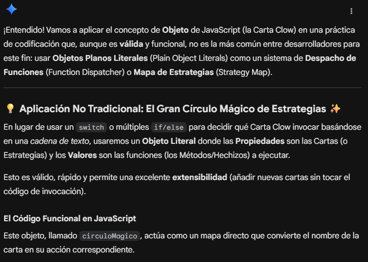

```bash

/**
 * Objeto Literal usado como un Despacho de Funciones (Function Dispatcher)
 * En lugar de usar switch/case, mapeamos directamente la 'Carta' (clave)
 * a su 'Hechizo' (valor, que es una función/método).
 */
const circuloMagico = {
    // La Propiedad 'Viento' invoca una función específica
    'Viento': (objetivo) => {
        console.log(`🌬️ ¡Viento, séllate! El objetivo (${objetivo}) es envuelto y neutralizado.`);
        return { cartaUsada: 'Viento', resultado: 'Neutralizado' };
    },

    // La Propiedad 'Salto' invoca otra función
    'Salto': (destino) => {
        console.log(`🤸 Carta Salto. ¡Elevando a Sakura para alcanzar el ${destino} con agilidad!`);
        return { cartaUsada: 'Salto', resultado: 'Movimiento Rápido' };
    },

    // La Propiedad 'Fuego' invoca otra función
    'Fuego': (intensidad) => {
        if (intensidad < 5) {
            console.log(`🔥 Llama de Fuego. Un pequeño resplandor para iluminar.`);
        } else {
            console.log(`🌋 ¡Fuego, ataca! Llamas intensas de nivel ${intensidad} desatadas.`);
        }
        return { cartaUsada: 'Fuego', resultado: 'Daño/Iluminación' };
    },

    // Una estrategia por defecto, que es una función también
    'NoReconocida': (carta) => {
        console.error(`❌ Kero-chan dice: ¡Error! La carta "${carta}" no está en el grimorio.`);
        return { cartaUsada: 'Error', resultado: 'Carta Inválida' };
    }
};

// --- FUNCIÓN DE INVOCACIÓN (El Hechizo de Sakura) ---

/**
 * Función que usa el objeto 'circuloMagico' para ejecutar la estrategia.
 * Es mucho más limpio que usar 'switch (nombreCarta) { case 'Viento': ... }'
 */
function invocarCarta(nombreCarta, ...parametros) {
    // 1. Buscamos la función (el hechizo) dentro del objeto.
    const accion = circuloMagico[nombreCarta];
    
    // 2. Si la carta existe, ejecutamos la función encontrada.
    if (accion) {
        console.log(`\nInvoca: **${nombreCarta}**`);
        return accion(...parametros); // Ejecutamos la función
    }
    
    // 3. Si no existe (es undefined), ejecutamos la función de estrategia 'NoReconocida'.
    return circuloMagico['NoReconocida'](nombreCarta);
}

// --- EJEMPLOS DE USO ---

// 1. Invocación exitosa: 'Viento'
const resultadoViento = invocarCarta('Viento', 'esfera oscura');
console.log('Resultado:', resultadoViento);

// 2. Invocación exitosa: 'Fuego' con un parámetro
const resultadoFuego = invocarCarta('Fuego', 8);
console.log('Resultado:', resultadoFuego);

// 3. Invocación de una carta no mapeada (usando la estrategia 'NoReconocida')
const resultadoNocturno = invocarCarta('Nocturno');
console.log('Resultado:', resultadoNocturno);

```
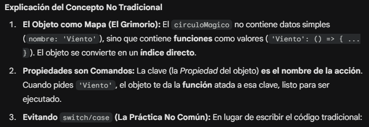

```bash
switch (nombreCarta) {
    case 'Viento': 
        // llama a la funcion de viento
        break;
    case 'Salto':
        // llama a la funcion de salto
        break;
    // ...
}

```
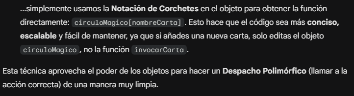

## FASE 3 - Revisión y refinamiento/evaluación

Utiliza la IA para evaluar tu código de la fase 2. Pídele que identifique legibilidad, funcionamiento, posibles bugs, buenas prácticas y sugiera al menos dos optimizaciones para mejorar la eficiencia o legibilidad. Implementa y documenta estos cambios.

**Prompt de Revisión y refinamiento/evaluación** — ` Basados en el siguiente código .js, identifica legibilidad, funcionamiento, posibles bugs, buenas prácticas y sugiere al menos dos optimizaciones para mejorar la eficiencia o legibilidad. `


```bash
/**
 * Objeto Literal usado como un Despacho de Funciones (Function Dispatcher)
 * En lugar de usar switch/case, mapeamos directamente la 'Carta' (clave)
 * a su 'Hechizo' (valor, que es una función/método).
 */
const circuloMagico = {
    // La Propiedad 'Viento' invoca una función específica
    'Viento': (objetivo) => {
        console.log(`🌬️ ¡Viento, séllate! El objetivo (${objetivo}) es envuelto y neutralizado.`);
        return { cartaUsada: 'Viento', resultado: 'Neutralizado' };
    },

    // La Propiedad 'Salto' invoca otra función
    'Salto': (destino) => {
        console.log(`🤸 Carta Salto. ¡Elevando a Sakura para alcanzar el ${destino} con agilidad!`);
        return { cartaUsada: 'Salto', resultado: 'Movimiento Rápido' };
    },

    // La Propiedad 'Fuego' invoca otra función
    'Fuego': (intensidad) => {
        if (intensidad < 5) {
            console.log(`🔥 Llama de Fuego. Un pequeño resplandor para iluminar.`);
        } else {
            console.log(`🌋 ¡Fuego, ataca! Llamas intensas de nivel ${intensidad} desatadas.`);
        }
        return { cartaUsada: 'Fuego', resultado: 'Daño/Iluminación' };
    },

    // Una estrategia por defecto, que es una función también
    'NoReconocida': (carta) => {
        console.error(`❌ Kero-chan dice: ¡Error! La carta "${carta}" no está en el grimorio.`);
        return { cartaUsada: 'Error', resultado: 'Carta Inválida' };
    }
};

// --- FUNCIÓN DE INVOCACIÓN (El Hechizo de Sakura) ---

/**
 * Función que usa el objeto 'circuloMagico' para ejecutar la estrategia.
 * Es mucho más limpio que usar 'switch (nombreCarta) { case 'Viento': ... }'
 */
function invocarCarta(nombreCarta, ...parametros) {
    // 1. Buscamos la función (el hechizo) dentro del objeto.
    const accion = circuloMagico[nombreCarta];
    
    // 2. Si la carta existe, ejecutamos la función encontrada.
    if (accion) {
        console.log(`\nInvoca: **${nombreCarta}**`);
        return accion(...parametros); // Ejecutamos la función
    }
    
    // 3. Si no existe (es undefined), ejecutamos la función de estrategia 'NoReconocida'.
    return circuloMagico['NoReconocida'](nombreCarta);
}

// --- EJEMPLOS DE USO ---

// 1. Invocación exitosa: 'Viento'
const resultadoViento = invocarCarta('Viento', 'esfera oscura');
console.log('Resultado:', resultadoViento);

// 2. Invocación exitosa: 'Fuego' con un parámetro
const resultadoFuego = invocarCarta('Fuego', 8);
console.log('Resultado:', resultadoFuego);

// 3. Invocación de una carta no mapeada (usando la estrategia 'NoReconocida')
const resultadoNocturno = invocarCarta('Nocturno');
console.log('Resultado:', resultadoNocturno); 

```

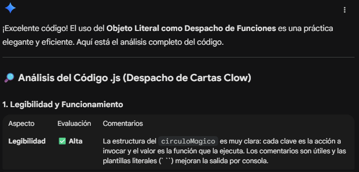

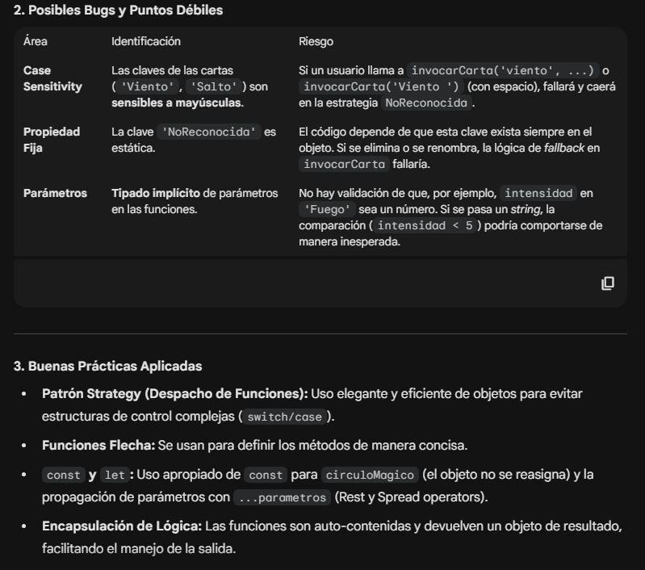

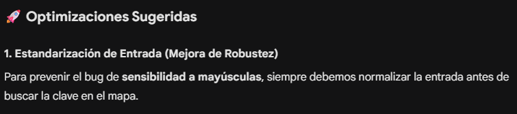

```bash

// Antes: const accion = circuloMagico[nombreCarta];

// 💡 OPTIMIZACIÓN 1: Normalizar la clave de la carta
function invocarCarta(nombreCarta, ...parametros) {
    // 1. Convertir la entrada a un formato estándar (p.ej., PascalCase o Lowercase)
    const claveNormalizada = nombreCarta.charAt(0).toUpperCase() + nombreCarta.slice(1).toLowerCase();
    
    // 2. Usar la clave normalizada para la búsqueda
    const accion = circuloMagico[claveNormalizada]; 
    
    // ... el resto del código
}

```
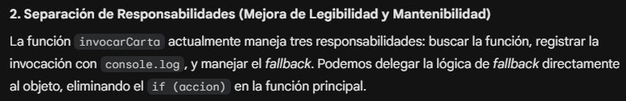

```bash

// 💡 OPTIMIZACIÓN 2: Usar el operador Nullish Coalescing (??) o OR (||) para simplificar la invocación.

function invocarCarta(nombreCarta, ...parametros) {
    // 1. Normalizar la clave (asumiendo que se implementó la Optimización 1)
    const clave = nombreCarta.charAt(0).toUpperCase() + nombreCarta.slice(1).toLowerCase();
    
    // 2. Usar 'OR' (||) o Nullish Coalescing (??) para seleccionar la función.
    // Si circuloMagico[clave] es undefined/falsy, usa circuloMagico['NoReconocida'].
    const accion = circuloMagico[clave] || circuloMagico['NoReconocida'];
    
    // El 'if' desaparece. Se llama directamente a la función encontrada o al fallback.
    console.log(`\nInvoca: **${clave}**`); 
    
    // Si la acción es NoReconocida, debe recibir el nombre original para el error.
    // Esto requiere un pequeño ajuste si se usó NoReconocida para pasar el nombre original.
    
    // Mejor estructura simplificada sin necesidad de cambiar el parámetro del fallback:
    return accion(...parametros) || circuloMagico['NoReconocida'](nombreCarta);
}

```
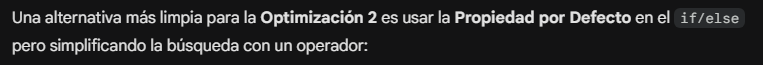

```bash

// Alternativa más limpia a la Optimización 2 (enfocada en concisión)
function invocarCarta(nombreCarta, ...parametros) {
    const clave = nombreCarta.charAt(0).toUpperCase() + nombreCarta.slice(1).toLowerCase();
    
    // 1. Utiliza el operador OR (||) para obtener la función, cayendo en 'NoReconocida' 
    // si no se encuentra (undefined).
    const accion = circuloMagico[clave] || circuloMagico.NoReconocida;

    // 2. Solo ejecuta si la acción NO es la 'NoReconocida' para evitar doble log.
    if (accion !== circuloMagico.NoReconocida) {
        console.log(`\nInvoca: **${clave}**`);
        return accion(...parametros); 
    }
    
    // Si es NoReconocida, se llama con el nombre de carta original como parámetro
    return accion(nombreCarta); 
}

```


**Prompt para Implementar y Documentar los cambios** — `Implementa estas optimizaciones en el código original para ver las diferencias, por favor.`

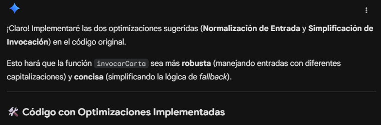

```bash

/**
 * Objeto Literal usado como un Despacho de Funciones (Function Dispatcher)
 * Nota: Las claves DEBEN seguir siendo camelCase o PascalCase para coincidir con la normalización.
 */
const circuloMagico = {
    'Viento': (objetivo) => {
        console.log(`🌬️ ¡Viento, séllate! El objetivo (${objetivo}) es envuelto y neutralizado.`);
        return { cartaUsada: 'Viento', resultado: 'Neutralizado' };
    },

    'Salto': (destino) => {
        console.log(`🤸 Carta Salto. ¡Elevando a Sakura para alcanzar el ${destino} con agilidad!`);
        return { cartaUsada: 'Salto', resultado: 'Movimiento Rápido' };
    },

    'Fuego': (intensidad) => {
        if (intensidad < 5) {
            console.log(`🔥 Llama de Fuego. Un pequeño resplandor para iluminar.`);
        } else {
            console.log(`🌋 ¡Fuego, ataca! Llamas intensas de nivel ${intensidad} desatadas.`);
        }
        return { cartaUsada: 'Fuego', resultado: 'Daño/Iluminación' };
    },

    // Estrategia por defecto
    'NoReconocida': (cartaInvalida) => {
        console.error(`❌ Kero-chan dice: ¡Error! La carta "${cartaInvalida}" no está en el grimorio.`);
        return { cartaUsada: 'Error', resultado: 'Carta Inválida' };
    }
};

// --- FUNCIÓN DE INVOCACIÓN OPTIMIZADA ---

/**
 * Función que usa el objeto 'circuloMagico' con las siguientes optimizaciones:
 * 1. Normalización de entrada (Robustez)
 * 2. Uso del operador || para simplificar el fallback (Concisión)
 */
function invocarCarta(nombreCarta, ...parametros) {
    
    // 💡 OPTIMIZACIÓN 1: Normalización de la clave (ej. 'viento' -> 'Viento', 'SALTO' -> 'Salto')
    // Esto asegura que la búsqueda por clave siempre funcione, ignorando mayúsculas/minúsculas.
    const claveNormalizada = nombreCarta.charAt(0).toUpperCase() + nombreCarta.slice(1).toLowerCase();
    
    // 💡 OPTIMIZACIÓN 2: Simplificación de Invocación usando el operador OR (||)
    // Busca la acción; si es 'undefined' (carta no existe), usa la función 'NoReconocida'.
    const accion = circuloMagico[claveNormalizada] || circuloMagico.NoReconocida;
    
    // Si la acción encontrada NO es la estrategia por defecto, la registramos.
    if (accion !== circuloMagico.NoReconocida) {
        console.log(`\nInvoca: **${claveNormalizada}**`);
        // Ejecutamos la acción con sus parámetros
        return accion(...parametros); 
    }
    
    // Si la acción es 'NoReconocida', se llama con el nombre de carta original
    return accion(nombreCarta);
}

// --- EJEMPLOS DE USO (Demostrando la Robustez) ---

console.log('--- Pruebas Normales ---');
// 1. Invocación exitosa: 'Viento'
const resultadoViento = invocarCarta('Viento', 'esfera oscura');
console.log('Resultado:', resultadoViento);

// 2. Invocación exitosa: 'Fuego' con un parámetro
const resultadoFuego = invocarCarta('Fuego', 8);
console.log('Resultado:', resultadoFuego);

console.log('\n--- Pruebas de Robustez (Case Insensitive) ---');
// 3. Invocación con minúsculas (Manejado por Optimización 1)
const resultadoSaltoMinusculas = invocarCarta('salto', 'techo del museo');
console.log('Resultado:', resultadoSaltoMinusculas);

// 4. Invocación con mayúsculas parciales (Manejado por Optimización 1)
const resultadoFuegoMixto = invocarCarta('fUeGo', 3);
console.log('Resultado:', resultadoFuegoMixto);

console.log('\n--- Pruebas de Fallback (Concisión) ---');
// 5. Invocación de una carta no mapeada (Manejado por Optimización 2)
const resultadoNocturno = invocarCarta('Nocturno');
console.log('Resultado:', resultadoNocturno);

```
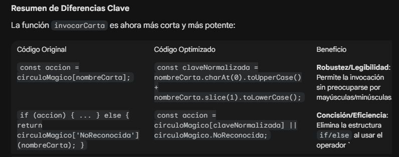

## FASE 4 - Presentación y colaboración

Usa la IA Generativa (prompts de imagen, diagramas de código como Mermaid/Graphviz) para crear un esquema visual, diagrama o infografía que explique la parte más compleja o inusual de tu solución a un público no técnico.

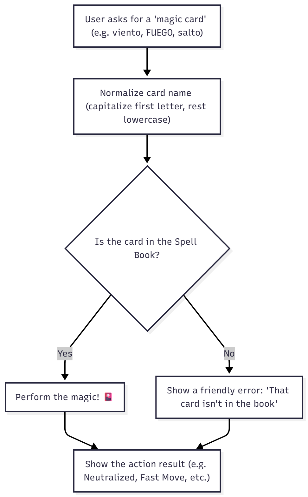

## CONCLUSIÓN

El proceso de Pensamiento Creativo con IA me ayudó a tener una mejor comprensión de conceptos de JavaScript que consideraba complicados, apoyándome a digerirlos de una manera más amigable con temas de mi interés. Es una herramienta que podemos y definitivamente seguiré utilizando para ampliar mis conocimientos y no quedarme sólo con explicaciones técnicas, si no para asentar conceptos completamente con temas de mi agrado para mayor facilidad de comprensión.